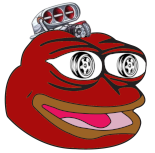

# PEPNG

## Overview

PEPNG (pronounced "pep-engine") is a basic OpenGL/C++ game engine created for COMP 371 at Concordia University. The current project both defines and implements the engine - the long term goal is to make a standalone source/editor. The engine currently supports basic rendering, synchronous I/O, and texture/model loading. Additional debug utilities were created to make on the fly modifications of the scene.

## Getting Started

This repository is the core library for PEPNG. You must include in another project to get started. You can find a simple implementation in the [template](https://github.com/pepng-CU/pepng-template).

There is additional information about PEPNG in the [wiki](https://github.com/pepng-CU/pepng/wiki).

## Features

PEPNG is full of useful features inspired by the [Unity](https://unity.com/) game engine. These features are currently strongly coupled with the actual game implementation for the assignment. Following are the features that are intended for the standalone engine.

### Smart Pointers

All classes only have smart pointer construction. This means that you can keep references of objects safely and not worry about garbage collection. Additionally, this makes it so you don't need to create most of destructors.

### One Namespace for Everything

All the features of the engine can be accessed in the `pepng` namespace. All classes should provide a constructor in the form `pepng::make...`. Some additional engine utilities can be found under the namespace. This makes it super easy to know what the engine offers using an IDE.

### Everything is a Component

This concept is further explained in the design. This allows for a complete modification of the behavior of the engine. Want to modify the `Renderer` to use raytracing? Simply extend the class and apply your logic and the engine will use your new behavior instead.

### Game Engine UI

PEPNG provides access to essentially every class in a ImGui window at runtime. Following are the implemented windows:

#### Hierarchy

Representation of the parent/child relation of `Object`s. Allows to select a specific instance that can modified in the `Inspector`.

#### Inspector

Displays all the `Component`s of an `Object`. All components will at least show up as a tab. We strongly encourage to make a menu controls for your script.

#### Debug

Provides functionalities that can be useful to debug the active scene.

### Dynamic IO

All input is mapped to input labels. This allows for multiple keys to bind to the same action. All of these are easily defined with `pepng::makeButton`, `pepng::makeAxis`, etc. They can then be accessed by the parent `Input` class. You can also bind/unbind any device/key at runtime.

### Texture Loading

PEPNG supports most image formats - using the `stb_image` loader.

### Object Loading

PEPNG allows you to load in objects/models/texutres in the `COLLADA` or `OBJ` format. This can be done using `pepng::load`. The method uses threads - which makes loading even large scene relatively quick (Sponza takes ~5 seconds - which was comparable to Unity/Blender loading the same scene).

## Engine Design

Most design decisions were made using Unity concept and terminologies. In addition, given the rendering was built in OpenGL, we assume that those low-level concepts (shaders, buffers, textures, etc) are understood. This section briefly explains the high-level solutions used for this engine.

### Object

An object is a very abstracted representation that englobes every instantiated object in the world. This includes in part empties, players, enemies, cameras, and even the scene itself. By default, an object has no functionality (not even a transform). You need to bind the components at runtime (which allows you to also unbind at runtime). To access binded components, you can use the generic `Object::getComponent<T>()` method.

### Transform Hierarchy

All objects are stored in a tree-like structure (or parent/child relationship). This means that transformations on parents are passed down to the children. This allows for more complex transformation being applied on multiple levels.

### Scene

The top-level parent of a collection of objects. We may also call this `World` in the case that there is a singular scene loaded. The engine doesn't really have an absolute parent - this is determined by the game programmer.

### Model

A representation of 2D/3D geometry. This hold purely the verticies/indicies in a VAO that will be used for OpenGL rendering.

### Material

A high-level rendering configuration for a model. This includes shaders and textures. This is how `COLLADA` defines rendering properties (and other engines follow the same ideology).

### Components

A script that is attached to an object to provide a functionality. Components can interact between each other - allowing to modify all logic at runtime. Following are the most basic components. You can easily define a new behavior by extending the `Component` class.

#### Transform

A container for position, rotation, and scale of an object. This provides high-level access for matrix transformations and quaternions.

#### Renderer

Uses a `Transform`, `Model`, and `Material` to display geometry using OpenGL. This is essential for displaying any object on a camera (typically just call the `render` method in loop).

#### Camera

A viewport for OpenGL. It may be weird that the camera is not itself an object, but this intentional. This allows other components to affect the camera - allowing to change properties dynamically.